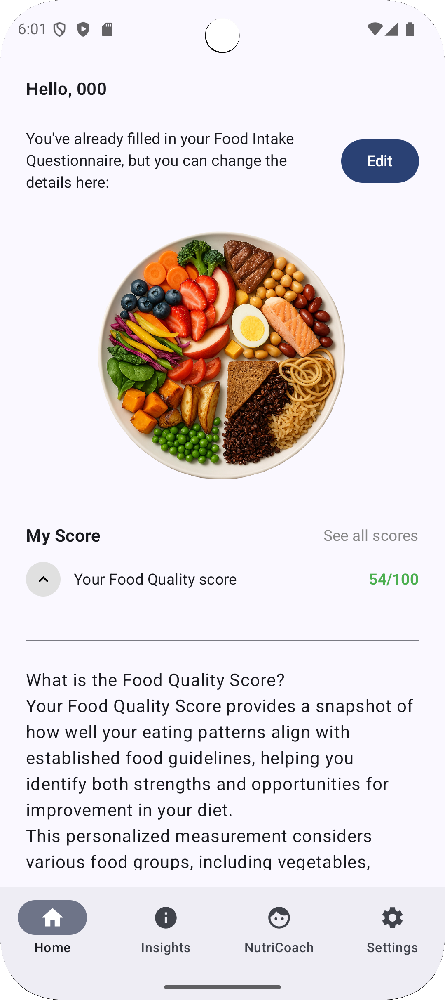
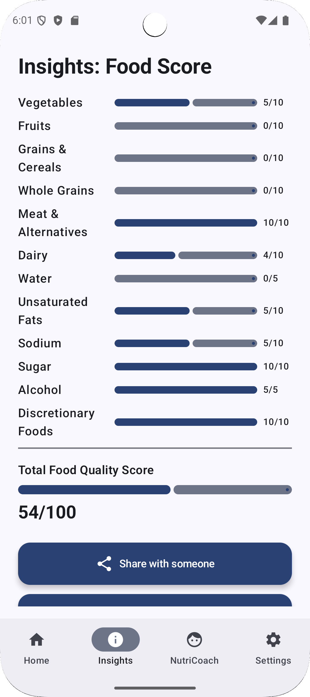
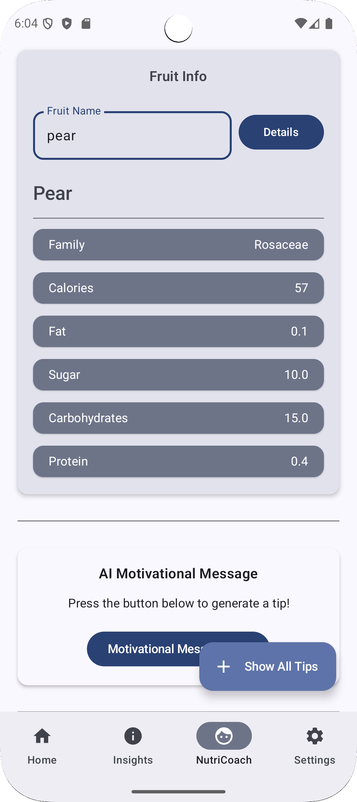
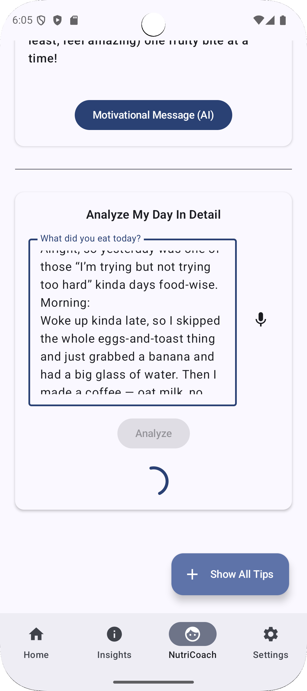
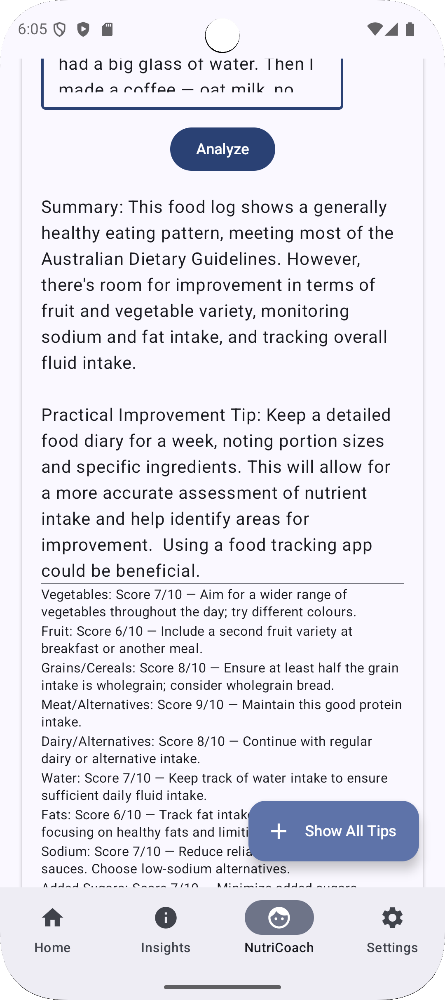
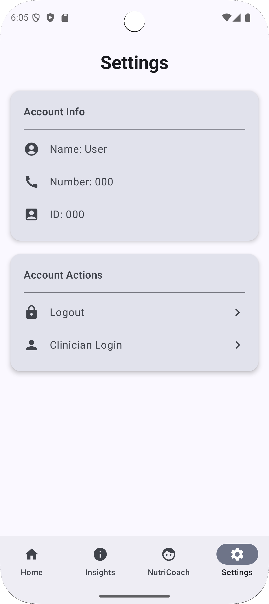
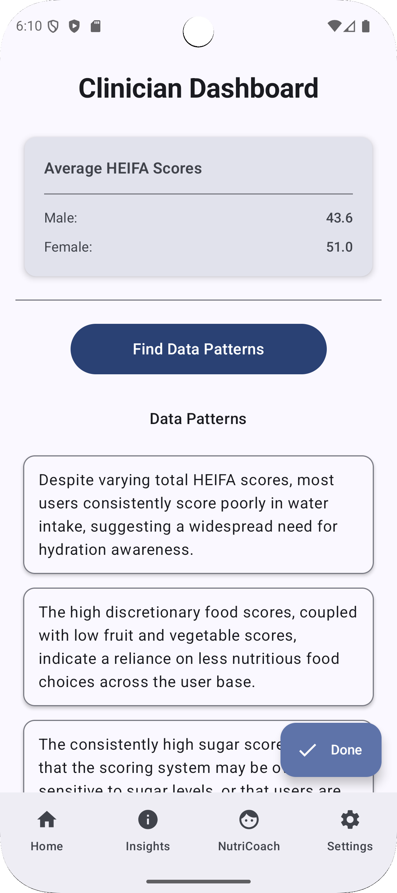
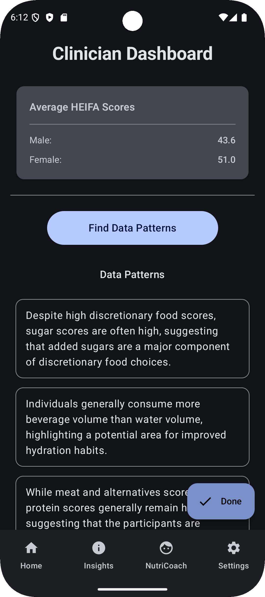

# Status: Files releasing in June 2025.

# Sample Screenshots (under development):

**Login**


**Home**


**Insights**


**NutriCoach – Fruit**


**NutriCoach – Analyse My Day**



**Settings**


**Clinician Dashboard (Light)**


**Clinician Dashboard (Dark)**


<br>

# 🥗 NutriTrack Pro - Personalised Nutrition Insights Platform

NutriTrack Pro is an Android app developed as part of the **FIT2081 Mobile App Development** unit at Monash University. It extends the core functionality of the original NutriTrack project into a **fully-featured clinical nutrition insights app**, combining local data persistence, multi-user support, public API integration, and generative AI-powered recommendations.

---
*
## 📲 Features

### 🔓 Authentication

- Account claiming using **User ID + Phone Number**
- Password setup and secure login
- **Multi-user login/logout**
- Persistent sessions unless user explicitly logs out

### 🥗 Dietary Tracking & Visualisation

- Questionnaire for food category selection, eating/sleep timing, and persona
- Food quality score and category breakdown based on HEIFA metrics
- **Progress bar visualisations** for food group scores
- Persona-based UX personalisation

### 📈 NutriCoach (NEW)

- Connects to the **[FruityVice API](https://www.fruityvice.com/)** for real fruit facts
- Uses **Gemini API** for GenAI-generated motivational nutrition tips
- Stores each AI tip per user for historical access
- Only shows fruit tips if the user's fruit score is non-optimal

### 🛠 Settings Screen (NEW)

- Displays user profile (name, phone)
- Logout button
- Access to **Admin dashboard** via clinician key

### 📊 Clinician Admin View (NEW)

- Unlock via passphrase: `dollar-entry-apples`
- Displays:
  - Average HEIFA scores (male/female)
  - GenAI-generated insights based on data patterns (e.g. “Users who scored high in vegetables also did in fruit”)

---

## 🗃️ Architecture & Technical Stack

| Layer        | Tech                                 |
| ------------ | ------------------------------------ |
| UI           | Jetpack Compose (Material 3)         |
| Data Storage | Room Database (seeded from CSV once) |
| Architecture | MVVM with Repository + ViewModel     |
| Network      | Retrofit + Kotlin Coroutines         |
| Persistence  | SharedPreferences for light settings |
| API Usage    | FruityVice API, Gemini GenAI API     |

- **LiveData** for reactive UI updates
- **CSV used only once** on first launch to seed Room DB
- Screens adapt to different device sizes

---

## 🧪 How to Run

1. Clone this repo:
   ```bash
   git clone https://github.com/yourusername/nutritrack-pro.git
   ```
