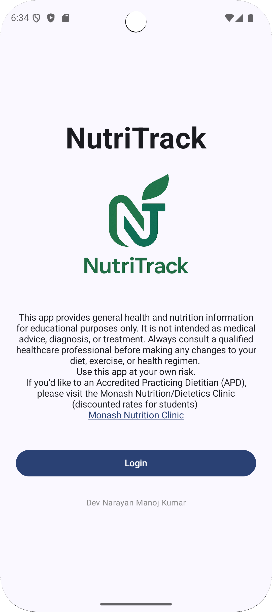

# Status: Files releasing in June 2025.

# Sample Screenshots (under development):

 

# 🥗 NutriTrack Pro - Personalised Nutrition Insights Platform

NutriTrack Pro is an Android app developed as part of the **FIT2081 Mobile App Development** unit at Monash University. It extends the core functionality of the original NutriTrack project into a **fully-featured clinical nutrition insights app**, combining local data persistence, multi-user support, public API integration, and generative AI-powered recommendations.

---

## 📲 Features

### 🔐 Authentication System
- **Account Claiming:** First-time users register with User ID + Phone Number, then set their Name and Password.
- **Secure Login:** Future logins use User ID + Password.
- **Session Persistence:** Keeps user logged in unless they manually logout.
- **Multi-User Support:** Users can switch between accounts.

### 🥗 Dietary Tracking & HEIFA Visualisation
- Food questionnaire for HEIFA scoring and analysis.
- Stores responses in `FoodIntake` table, linked via foreign key to `Patient`.
- Graphical score breakdowns per food group (e.g. fruit, veg, grains).
- Persona-tailored visuals and interpretations.

### 📈 NutriCoach (Enhanced)
- **Conditional Fruit Facts:** If fruit score is non-optimal, user can fetch data from the [FruityVice API](https://www.fruityvice.com/).
- **Motivational AI Tips:** Uses Gemini API to generate personalised, non-repetitive encouragements.
- **Historical Tips:** All AI responses stored in `NutriCoachTips` table and viewable in a modal.
- **Fallback Behaviour:** If fruit score is optimal, shows motivational image via `https://picsum.photos/`.
- **NEW: Analyze My Day:**
  - Users can enter or **dictate** (voice-to-text) a free-form daily food log.
  - Gemini AI evaluates the entry, **scores each dietary group**, and delivers detailed, evidence-based feedback using national guidelines.
  - Encourages real-world reflection and ongoing habit change.

#### 🛠️ Settings Screen
- Shows logged-in user’s name and phone number.
- **Logout** button to clear session.
- Access to **Admin Mode** via clinician key.

### 🩺 Clinician Admin View
- **Access Key:** `dollar-entry-apples`
- **📊 Stats Displayed:**
  - Avg HEIFA scores (male vs. female)
  - 3 GenAI-generated insights from Room DB patterns
    - e.g. "Most users who scored high in vegetables also scored high in fruits"
---

## 🧱 Architecture

| Layer         | Technology                                    |
| ------------- | --------------------------------------------- |
| UI            | Jetpack Compose (Material 3)                  |
| Architecture  | MVVM (ViewModel + Repository)                 |
| Data Layer    | Room DB (Patient, FoodIntake, NutriCoachTips) |
| Network       | Retrofit + Coroutines                         |
| State Mgmt    | StateFlow                                     |
| Persistence   | SharedPreferences                             |
| External APIs | FruityVice API, Gemini API (GenAI)            |

- **CSV Import:** Patient data seeded from CSV on **first launch only**
- **Responsiveness:** UI scales gracefully across screen sizes
- **Reactive UI:** Uses StateFlow to reflect database updates in real-time

---
